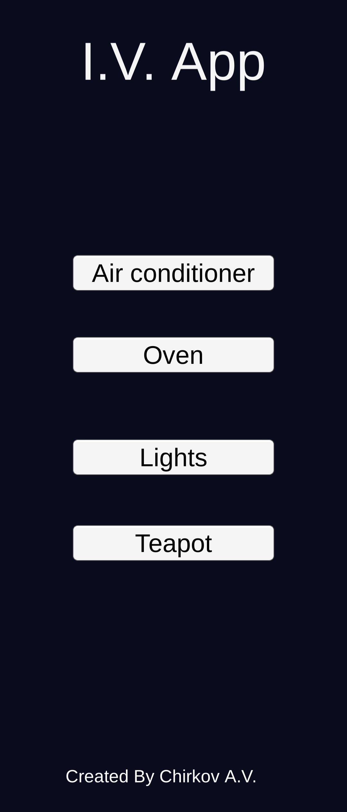
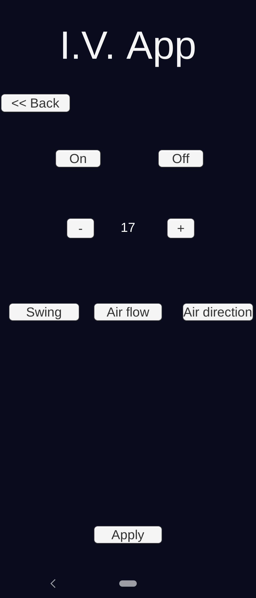
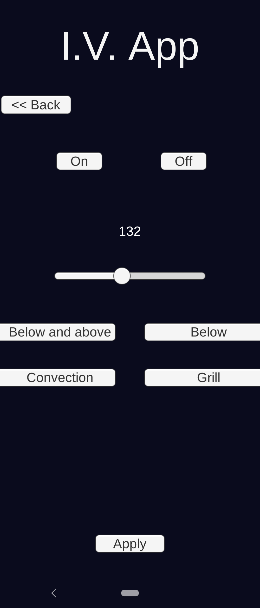
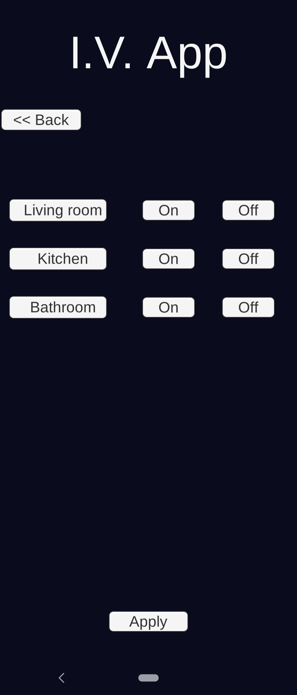
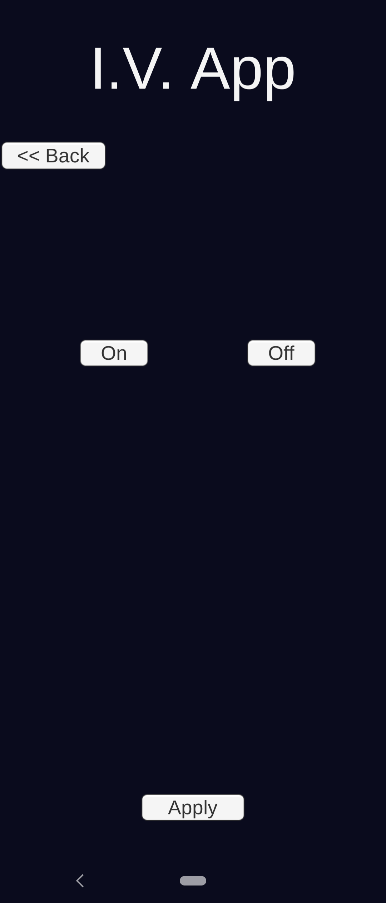

# IVApp
-----
Данное приложение разработано для управления некоторыми функциями в доме.   
Приложение состоит из пяти страниц: главной, управление кондиционером, управление духовой печью, управление светом и управление чайником.
# Главная страница:  
 </html>  
Страница, осуществляющая переход между остальными страницами
# Страница Кондиционер:  
  </html>  
Здесь вы можете его включить/выключить, а так же настроить по своему усмотрению:  
Установить температуру, а так же режим обдува кондиционера
# Страница Духовая печь:  
  </html>  
Здесь вы можете его включить/выключить, а так же настроить по своему усмотрению:  
Установить температуру, а так же режим нагрева (сверху и снизу, только снизу, конвекция, гриль)  
# Страница Включение света:  
  </html>  
Здесь вы можете: включить/выключить свет в каждой из комнат (гостинная, кухня, ванная комната)  
# Страница Включение чайника:  
  </html>  
Здесь вы можете: включить/выключить эл. чайник

